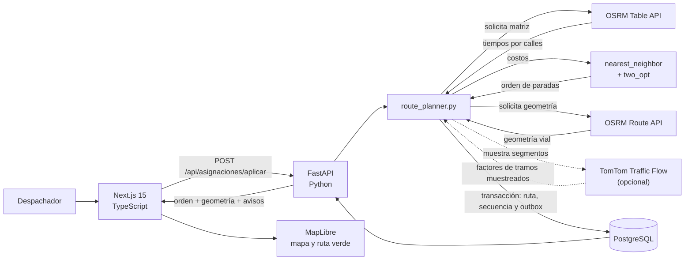

# Arquitectura de Rutas Pasto

Abre el [esquema 3D interactivo](./arquitectura-3d.html) para recorrer las
conexiones y abrir desde cada componente los archivos correspondientes en VS Code.

Vista para presentación técnica y operación: el producto permite registrar pedidos,
optimizar rutas de calle dentro de Pasto, seguir una entrega por guía y enviar avisos
solo por canales autorizados.

## Flujo de optimización



OSRM calcula los tiempos y la geometría por calles. TomTom solo puede ajustar los
tramos que el backend muestrea sobre esa geometría; no sustituye el trazado vial ni
representa cobertura completa de la ciudad. Si esos factores cambian el orden, el
backend vuelve a pedir la geometría vial antes de persistir la ruta.

## Estructuras de datos en el producto

| Estructura                             | Uso concreto                                                                                                               | Implementación                                                                                                                                                                                                            |
| -------------------------------------- | -------------------------------------------------------------------------------------------------------------------------- | ------------------------------------------------------------------------------------------------------------------------------------------------------------------------------------------------------------------------- |
| Lista simplemente enlazada + cola FIFO | Serializa escrituras de ubicación GPS y aplica backpressure.                                                               | [`queue.py`](../backend/app/core/structures/queue.py), [`location_event_queue.py`](../backend/app/services/location_event_queue.py)                                                                                       |
| Lista simplemente enlazada + pila LIFO | Deshace el último recálculo usando snapshots persistidos de la ruta.                                                       | [`stack.py`](../backend/app/core/structures/stack.py), [`route_planner.py`](../backend/app/services/route_planner.py)                                                                                                     |
| Lista doblemente enlazada              | Cachés LRU de matrices de duración y segmentos de tráfico; las referencias a nodos permiten moverlos o retirarlos en O(1). | [`doubly_linked_list.py`](../backend/app/core/structures/doubly_linked_list.py), [`cached_matrix_provider.py`](../backend/app/core/routing/cached_matrix_provider.py), [`traffic.py`](../backend/app/services/traffic.py) |
| Grafo dirigido + min-heap              | Dijkstra y A* sobre aristas ponderadas; son algoritmos del núcleo, no reemplazan el grafo vial de OSRM en producción.      | [`graph.py`](../backend/app/core/graph/graph.py), [`min_heap.py`](../backend/app/core/structures/min_heap.py), [`dijkstra.py`](../backend/app/core/graph/dijkstra.py), [`astar.py`](../backend/app/core/graph/astar.py)   |
| Vecino más cercano + 2-opt             | Propone y mejora el orden de visita a partir de la matriz de tiempos viales.                                               | [`nearest_neighbor.py`](../backend/app/core/optimization/nearest_neighbor.py), [`two_opt.py`](../backend/app/core/optimization/two_opt.py)                                                                                |
| Asignación por cercanía y balance      | Agrupa pedidos para los repartidores seleccionados antes de optimizar cada ruta.                                           | [`assign_orders.py`](../backend/app/core/optimization/assign_orders.py)                                                                                                                                                   |

## Seguimiento, chat y avisos al cliente

```mermaid
sequenceDiagram
    autonumber
    actor Cliente
    participant UI as Next.js / TypeScript
    participant API as FastAPI / Python
    participant DB as PostgreSQL
    participant IA as Proveedor de chat
    participant Repartidor
    participant Canal as SMTP / Twilio

    Cliente->>UI: Consulta la guía y pregunta por el pedido
    UI->>API: guía + pregunta
    API->>DB: Resuelve la guía y obtiene estado de ese pedido
    API->>API: Sustituye el texto libre por una intención canónica
    opt La pregunta pide hora o tiempo de llegada
        API->>API: Añade solo el ETA aproximado disponible
    end
    API->>IA: Intención canónica + estados permitidos
    alt El proveedor responde
        IA-->>API: Respuesta breve sobre ese pedido
    else Timeout, rate limit o error del proveedor
        API->>API: Respuesta local basada en el estado verificado y ETA disponible
    end
    API-->>UI: Respuesta y seguimiento
    UI-->>Cliente: Estado, mapa y chat

    Note over API,IA: La guía, dirección, coordenadas, nombre, teléfono e IDs internos no se envían al modelo.

    opt El cliente autorizó correo, SMS o ambos
        API->>DB: Guarda el aviso de asignación en el outbox con la ruta
        Repartidor->>API: Reporta posición GPS autenticada
        API->>API: Cola FIFO serializa el evento GPS
        API->>DB: Persiste la ubicación y consulta la siguiente parada
        alt Está dentro de 500 m y el canal sigue autorizado
            API->>DB: Encola un único aviso de cercanía
            alt Proveedor configurado
                API->>Canal: Intenta entrega después del commit
                Canal-->>Cliente: Aviso de asignación o cercanía
            else Proveedor sin configurar
                Note over API,DB: El aviso permanece pendiente; no se finge su entrega
            end
        else Lejos o sin consentimiento
            Note over API,DB: No se encola ningún aviso de cercanía
        end
    end
```

Los 500 m son una señal geodésica de proximidad, no una ruta peatonal ni una promesa
de hora de llegada. Antes de entregar cada aviso se vuelven a validar el consentimiento
y el dato de contacto actual. Sin credenciales SMTP/Twilio, los avisos no se simulan como enviados:
quedan pendientes. El worker periódico de reintentos requiere un proceso persistente; en AWS se
ejecuta dentro del servicio FastAPI de ECS, no en una función efímera.

## Despliegue AWS preparado

El frontend Next.js, la API FastAPI y PostgreSQL se operan como componentes
independientes: dos imágenes/conjuntos de tareas ECS y una instancia RDS privada.
El ALB mantiene un solo origen para el navegador (`/api/*` hacia FastAPI y el
resto hacia Next.js). Alembic corre en una tarea puntual antes de habilitar los
servicios web. La infraestructura y su procedimiento local están en
[`deploy/aws/README.md`](../deploy/aws/README.md); no implica que recursos hayan
sido creados en AWS.

## Límites deliberados

- El mapa y la geometría representan calles oficiales devueltas por OSRM, no líneas
  rectas entre coordenadas.
- Dijkstra/A* y el grafo propio muestran el núcleo académico; el enrutamiento real
  usa OSRM para reflejar la red vial de Pasto.
- TomTom cubre solo tramos muestreados. El ETA se presenta como aproximado.
- El chat responde sobre la guía consultada. Solo recibe la pregunta normalizada,
  estados permitidos y, si se pregunta por llegada, el ETA aproximado disponible.
- Correo y SMS requieren consentimiento individual por canal y credenciales privadas
  en el backend.
